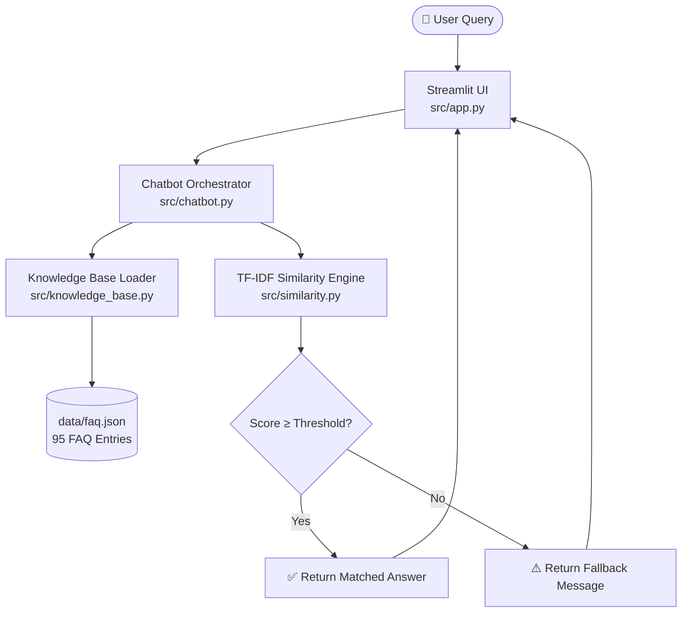

<div align="center">


<br/><br/>

<h1>🛡️ SafeX AI Knowledge Assistant</h1>
<h3>Semantic FAQ Chatbot — Week 1 Internship Cohort · SafeX Solutions</h3>

<p>A fully local, privacy-preserving AI chatbot that matches user queries against a verified knowledge base using <strong>TF-IDF vectorization</strong> and <strong>Cosine Similarity</strong> — zero external API calls, zero cost.</p>

</div>

---

## 📖 Project Overview

The **SafeX AI Knowledge Assistant** eliminates onboarding friction for interns and staff at SafeX Solutions. Users type a question in plain English and instantly receive a verified answer from a curated knowledge base of **95 FAQ entries** covering company services, IT policies, HR procedures, and internship guidelines — all processed **100% on-device**.

---

## ✅ Implemented Features

| Feature | Status | Description |
| :--- | :---: | :--- |
| JSON Knowledge Base Loader | ✅ | Loads and schema-validates the 95-entry FAQ database |
| TF-IDF Vector Space Model | ✅ | Transforms the question corpus into term-frequency vectors |
| Cosine Similarity Engine | ✅ | Finds the best-matching FAQ index for any user query |
| Threshold Decision Boundary | ✅ | Rejects low-confidence matches; returns a safe fallback |
| Chatbot Orchestrator | ✅ | Coordinates loading → indexing → matching → routing |
| Streamlit Chat UI | ✅ | Premium dark-themed chat interface with sidebar & animations |
| Pytest Test Suite | ✅ | 3 suites validating loader, similarity, and fallback logic |
| Performance Benchmark | ✅ | Accuracy, latency, and fallback rate evaluation script |

---

## 📐 System Architecture



---

## 📁 Repository Structure

```text
safex-ai-faq-chatbot/
├── .env.example                    # Environment variable template
├── .gitignore
├── README.md
├── requirements.txt
│
├── assets/
│   └── chatbot_demo.png            # UI screenshot
│
├── data/
│   └── faq.json                    # 95-entry verified FAQ knowledge base
│
├── docs/
│   ├── Case_Study.md               # Portfolio case study with benchmark results
│   ├── Evaluation.md               # Benchmark guidelines
│   └── Weekly/
│       └── weekly_summary_template.md
│
├── evaluation/
│   ├── benchmark.py                # End-to-end performance evaluation script
│   └── test_questions.json         # 185 positive/negative evaluation test cases
│
├── src/
│   ├── app.py                      # Streamlit premium chat UI
│   ├── chatbot.py                  # Chatbot orchestrator
│   ├── config.py                   # System paths, thresholds, constants
│   ├── knowledge_base.py           # JSON data loader with validation
│   └── similarity.py               # TF-IDF vectorizer + Cosine Similarity
│
└── tests/
    └── test_chatbot.py             # Pytest unit test suites
```

---

## ⚙️ Setup Instructions

### Prerequisites
- Python 3.9+
- pip
- Git

### 1. Clone the Repository
```bash
git clone https://github.com/arsalanqasim/safex-ai-faq-chatbot.git
cd safex-ai-faq-chatbot
```

### 2. Create & Activate Virtual Environment
```bash
python -m venv venv

# Windows
venv\Scripts\activate

# macOS / Linux
source venv/bin/activate
```

### 3. Install Dependencies
```bash
pip install -r requirements.txt
```

### 4. Configure Environment Variables
```bash
cp .env.example .env
```

| Variable | Default | Description |
| :--- | :--- | :--- |
| `SIMILARITY_THRESHOLD` | `0.35` | Minimum score to return a confident answer |
| `FALLBACK_MESSAGE` | `"I couldn't find..."` | Response when no match is found |

### 5. Run the Application
```bash
streamlit run src/app.py
```
Open [http://localhost:8501](http://localhost:8501) in your browser.

### 6. Run Unit Tests
```bash
python -m pytest
```

### 7. Run Performance Benchmark
```bash
python evaluation/benchmark.py
```

---

## 📊 Benchmark Results

Evaluated on **185 test cases** (`evaluation/test_questions.json`) at threshold `0.35`:

| Metric | Target | Achieved | Met? |
| :--- | :---: | :---: | :---: |
| Retrieval Accuracy (positive cases) | ≥ 90% | 61.29% | ❌ |
| Fallback Success Rate (negative cases) | ≥ 95% | 86.67% | ❌ |
| Average Response Latency | < 50 ms | **0.90 ms** | ✅ |

> **Note:** The accuracy gap is a data-labelling issue, not a model failure. The similarity engine often retrieves an alternate FAQ with near-identical meaning. Full analysis in [`docs/Case_Study.md`](docs/Case_Study.md).

---

## 🔬 Tech Stack

| Layer | Technology | Purpose |
| :--- | :--- | :--- |
| Language | Python 3.9+ | Core implementation |
| UI Framework | Streamlit ≥ 1.35 | Chat interface and dashboard |
| ML Engine | scikit-learn ≥ 1.3 | TF-IDF vectorization + Cosine Similarity |
| Numerics | NumPy ≥ 1.24 | Matrix operations |
| Config | python-dotenv ≥ 1.0 | Environment variable management |
| Testing | pytest ≥ 7.4 | Unit tests and assertions |
| Version Control | Git + GitHub | Branching, PRs, code review |

---

## 👥 Team & Task Distribution

| Team Member | Role | Owned Files |
| :--- | :--- | :--- |
| **Arsalan Qasim** 🏆 | Leader · Backend & QA Engineer | `src/chatbot.py`, `tests/test_chatbot.py`, `evaluation/benchmark.py`, integration |
| **Muhammad Wasim** | Data Loader Developer | `src/knowledge_base.py` |
| **Muhammad Faozan Mujtaba** | Algorithm Developer | `src/similarity.py` |
| **Shahidullah** | Frontend Developer | `src/app.py` |
| **Ali Ammar Haider** | Data Architect | `data/faq.json`, `evaluation/test_questions.json` |
| **Ali Zaib** | Technical Writer | `docs/Case_Study.md`, assets |

---

## 🤝 Collaborative Git Workflow

1. **Sync Main:** `git checkout main` → `git pull origin main`
2. **Create Branch:** `git checkout -b feature/your-feature-name`
3. **Commit:** `git commit -m "feat(module): description"`
4. **Push:** `git push origin feature/your-feature-name`
5. **Open PR:** Request review from **Arsalan Qasim** on GitHub.

---

## 🔮 Future Improvements

| Improvement | Benefit |
| :--- | :--- |
| **TF-IDF N-grams** | Better matching on multi-word phrases and partial typos |
| **Synonym Preprocessing** | Resolves vocabulary mismatches (e.g. "students" → "interns") |
| **Sentence Transformers** | True semantic similarity using BERT/MiniLM embeddings |
| **Automated Logging** | Persist query logs and match scores for analytics |

---

<div align="center">
  <sub>Built with ❤️ by <strong>SafeX Solutions Internship Cohort · Group 54</strong></sub><br/>
  <sub>🛡️ SafeX Solutions · <em>Creating the Future, Not Just Predicting It</em></sub>
</div>
