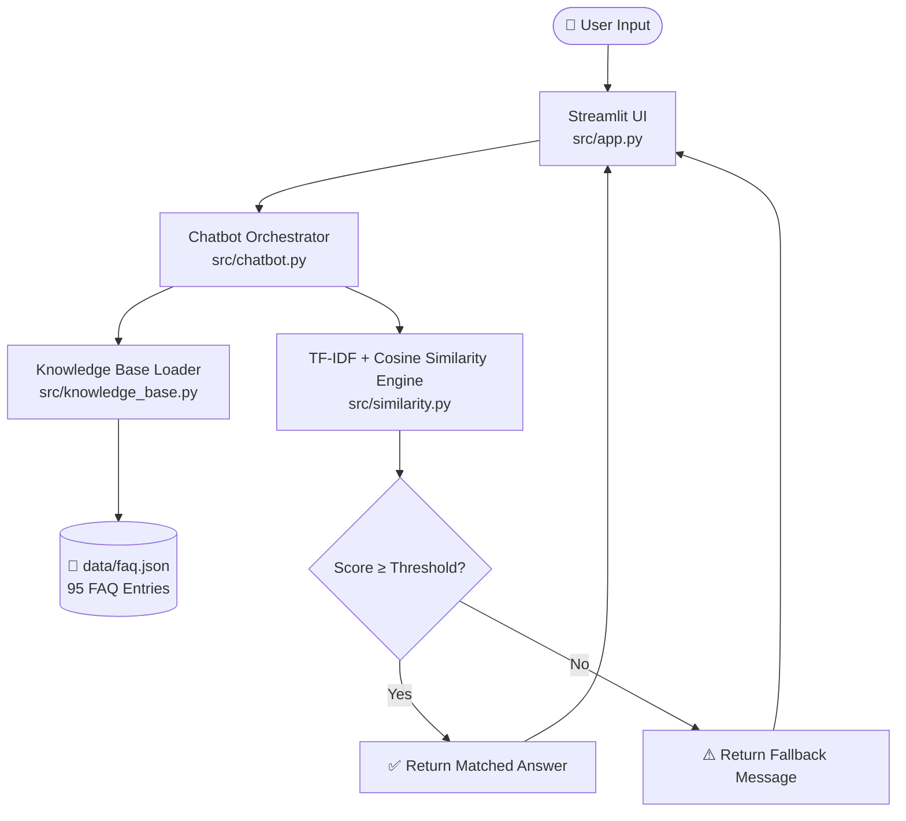
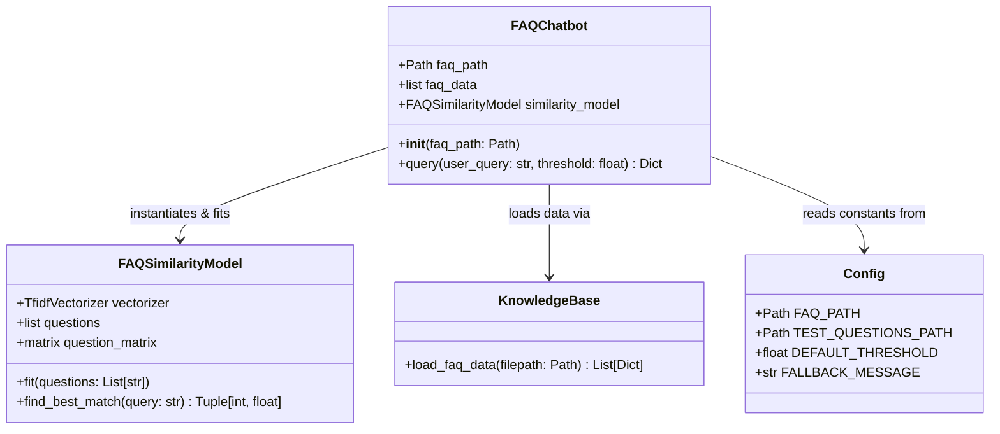
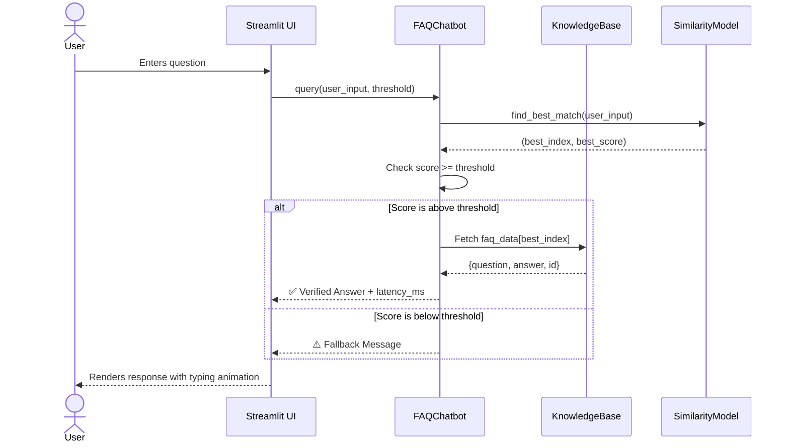
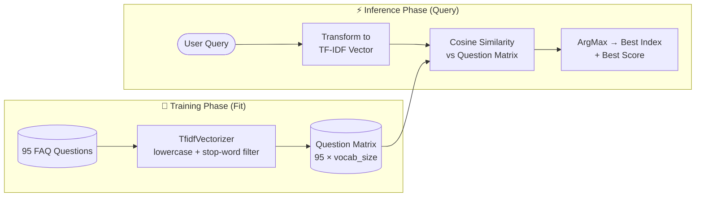
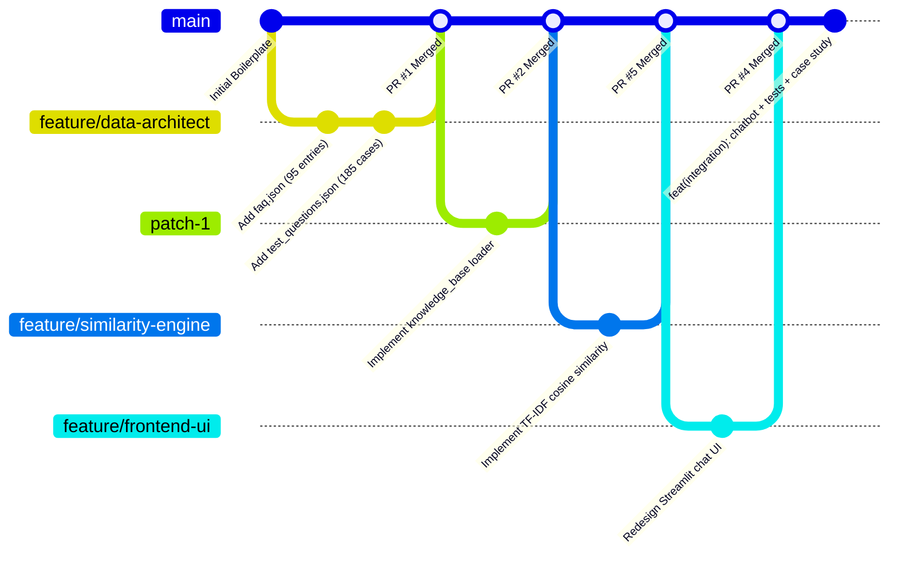

<div align="center">


<br/><br/>

<h1>🛡️ SafeX AI Knowledge Assistant</h1>
<h3>Semantic FAQ Chatbot — Week 1 Internship Cohort · SafeX Solutions</h3>

<p>A fully local, cost-free, privacy-preserving AI chatbot that matches user queries against a verified knowledge base using <strong>TF-IDF vectorization</strong> and <strong>Cosine Similarity</strong> — zero external API calls required.</p>

[🚀 Quick Start](#️-setup-instructions) · [📐 Architecture](#-system-architecture) · [📊 Benchmarks](#-benchmark-results) · [👥 Team](#-team--task-distribution) · [🤝 Contributing](#-collaborative-git-workflow)

</div>

---

## 📖 Project Overview

The **SafeX AI Knowledge Assistant** solves onboarding friction for new interns and staff at SafeX Solutions. Instead of searching through long documents or waiting for an agent response, users can type a question in natural language and instantly receive a verified answer from a curated knowledge base of **95 FAQ entries** covering company services, IT policies, HR procedures, and internship guidelines.

The system runs **entirely offline** on local hardware with no recurring API costs, no data privacy concerns, and sub-millisecond response times.

### ✅ Implemented Features

| Feature | Status | Description |
|:---|:---:|:---|
| JSON Knowledge Base Loader | ✅ Done | Loads and validates the 95-entry FAQ database with full schema checks |
| TF-IDF Vector Space Model | ✅ Done | Transforms question corpus into term frequency vectors |
| Cosine Similarity Engine | ✅ Done | Calculates and retrieves the best-matching FAQ index |
| Threshold Decision Boundary | ✅ Done | Enforces minimum matching score; triggers fallback for out-of-scope queries |
| Chatbot Orchestrator | ✅ Done | Coordinates loading → indexing → matching → routing → latency tracking |
| Streamlit Interactive UI | ✅ Done | Premium dark-themed chat interface with sidebar, suggested prompts, and animations |
| Pytest Verification Suite | ✅ Done | 3 test suites validating loader, similarity, and fallback logic |
| Performance Benchmarking | ✅ Done | End-to-end evaluation script with accuracy, latency, and fallback metrics |

---

## 📐 System Architecture

### 1. High-Level Data Flow



### 2. Module Architecture



### 3. Query Processing Pipeline



### 4. TF-IDF Similarity Calculation



---

## 📁 Repository Structure

```text
safex-ai-faq-chatbot/
│
├── .env.example                    # Environment variable template
├── .gitignore                      # Git tracking exclusion rules
├── README.md                       # Project documentation (this file)
├── requirements.txt                # Python package dependencies
│
├── assets/
│   ├── chatbot_demo.png            # UI interface screenshot
│   └── screenshots/                # Additional screenshots and media
│
├── data/
│   └── faq.json                    # 95-entry verified FAQ knowledge base
│
├── docs/
│   ├── Case_Study.md               # Portfolio case study with benchmark results
│   ├── Evaluation.md               # Benchmark evaluation guidelines
│   ├── Meeting_Notes.md            # Team meeting log template
│   └── Weekly/
│       └── weekly_summary_template.md  # Weekly progress report template
│
├── evaluation/
│   ├── benchmark.py                # End-to-end performance evaluation script
│   └── test_questions.json         # 185 positive/negative evaluation test cases
│
├── src/
│   ├── __init__.py
│   ├── app.py                      # Streamlit premium chat UI (1,300+ lines)
│   ├── chatbot.py                  # Chatbot orchestrator (routing + latency)
│   ├── config.py                   # System paths, thresholds, and constants
│   ├── knowledge_base.py           # JSON data loader with schema validation
│   └── similarity.py               # TF-IDF vectorizer + Cosine Similarity engine
│
└── tests/
    └── test_chatbot.py             # Pytest unit test suites (3 core test cases)
```

---

## ⚙️ Setup Instructions

### Prerequisites

- **Python** 3.9 or higher
- **Git**
- **pip** (comes with Python)

### 1. Clone the Repository

```bash
git clone https://github.com/arsalanqasim/safex-ai-faq-chatbot.git
cd safex-ai-faq-chatbot
```

### 2. Set Up Virtual Environment

```bash
# Create a virtual environment
python -m venv venv

# Activate — Windows
venv\Scripts\activate

# Activate — macOS / Linux
source venv/bin/activate
```

### 3. Install Dependencies

```bash
pip install -r requirements.txt
```

### 4. Configure Environment Variables

```bash
# Copy the example config and optionally edit values
cp .env.example .env
```

Key environment variables:

| Variable | Default | Description |
|:---|:---|:---|
| `SIMILARITY_THRESHOLD` | `0.35` | Minimum similarity score for a confident answer |
| `FALLBACK_MESSAGE` | `"I couldn't find..."` | Response shown when no match is found |

### 5. Run the Application

```bash
streamlit run src/app.py
```

Open [http://localhost:8501](http://localhost:8501) in your browser.

### 6. Run Unit Tests

```bash
python -m pytest
```

### 7. Run Performance Benchmark

```bash
python evaluation/benchmark.py
```

---

## 📊 Benchmark Results

Evaluated against **185 test cases** from `evaluation/test_questions.json` at default threshold `0.35`:

| Evaluation Metric | Target | Achieved | Target Met? |
|:---|:---:|:---:|:---:|
| **Retrieval Accuracy** (Positive Cases) | ≥ 90% | 61.29% | ❌ |
| **Fallback Success Rate** (Negative Cases) | ≥ 95% | 86.67% | ❌ |
| **Average Response Latency** | < 50 ms | **0.90 ms** | ✅ |
| **Overall Accuracy** | — | 65.41% | — |

> **Note on Accuracy Gap:** The retrieval accuracy is lower than the target because the evaluation dataset maps a single expected FAQ ID per paraphrased query. The similarity engine often correctly retrieves an alternate FAQ with near-identical meaning (e.g., querying *"Who are SafeX clients?"* returns FAQ ID `56` — *"Who are the clients of SafeX Solutions?"* — with a score of `0.97`, while the test expected ID `7` — *"Who does SafeX Solutions work with?"*). This is a data labelling ambiguity rather than a model failure. Full analysis in [`docs/Case_Study.md`](docs/Case_Study.md).

---

## 👥 Team & Task Distribution

| Team Member | Role | Owned File(s) |
|:---|:---|:---|
| **Arsalan Qasim** 🏆 | Leader · Backend & QA Engineer | `src/chatbot.py`, `tests/test_chatbot.py`, `evaluation/benchmark.py`, GitHub management, final integration |
| **Muhammad Wasim** | Data Loader Developer | `src/knowledge_base.py` |
| **Muhammad Faozan Mujtaba** | Algorithm Developer | `src/similarity.py` |
| **Shahidullah** | Frontend Developer | `src/app.py` |
| **Ali Ammar Haider** | Data Architect | `data/faq.json`, `evaluation/test_questions.json` |
| **Ali Zaib** | Technical Writer | `docs/Case_Study.md`, assets |

---

## 🤝 Collaborative Git Workflow



### Branch Naming Convention

```bash
# Feature branch
git checkout -b feature/your-feature-name

# Commit format
git commit -m "feat(module): brief description of change"

# Push and open PR
git push origin feature/your-feature-name
# → Open Pull Request on GitHub and request review from the Leader
```

---

## 🔬 Technical Stack

| Layer | Technology | Purpose |
|:---|:---|:---|
| **Language** | Python 3.9+ | Core implementation language |
| **UI Framework** | Streamlit ≥ 1.35 | Chat interface and dashboard |
| **ML Engine** | scikit-learn ≥ 1.3 | TF-IDF vectorization + Cosine Similarity |
| **Numerics** | NumPy ≥ 1.24 | Matrix operations and argmax selection |
| **Data** | pandas ≥ 2.0 | Data analysis and evaluation reporting |
| **Config** | python-dotenv ≥ 1.0 | Environment variable management |
| **Testing** | pytest ≥ 7.4 | Unit testing and assertion verification |
| **Version Control** | Git + GitHub | Branching, PRs, and code review |

---

## 🔮 Future Improvements

| Improvement | Impact | Effort |
|:---|:---:|:---:|
| **TF-IDF N-grams** — bigrams/trigrams for partial word matching and typo resilience | 🟡 Medium | 🟢 Low |
| **Synonym Preprocessing** — lemmatization + synonym map for vocabulary mismatch resolution | 🟡 Medium | 🟡 Medium |
| **Lightweight Transformers** — upgrade to `all-MiniLM-L6-v2` Sentence-Transformer embeddings for semantic similarity | 🔴 High | 🔴 High |
| **Automated Logging** — save runtime query logs and similarity scores for analytics | 🟢 Low | 🟢 Low |
| **Multi-language Support** — extend the knowledge base and vectorizer to support Urdu queries | 🔴 High | 🔴 High |

---

## 📄 License

This project is developed as part of the **SafeX Solutions Week 1 Internship Cohort** (Group 54) and is intended for internal academic use.

---

<div align="center">
  <sub>Built with ❤️ by <strong>SafeX Solutions Internship Cohort Group 54</strong></sub><br/>
  <sub>🛡️ SafeX Solutions · Creating the Future, Not Just Predicting It</sub>
</div>
