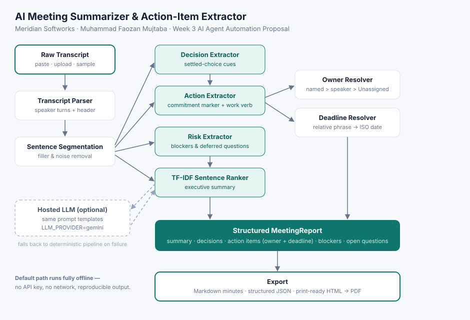

# AI Meeting Summarizer & Action-Item Extractor

**Member:** Muhammad Faozan Mujtaba
**Week 3 module:** `week3/src/modules/meeting_summarizer/`
**Target company:** Meridian Softworks — an original, fictional software house in Islamabad
**Status:** Submission Ready

---

## 1. The problem

Meridian Softworks runs three recurring meeting types every week: sprint reviews, client
calls and hiring syncs. Someone takes notes in roughly half of them. Commitments made out
loud — "I'll chase the client for credentials by tomorrow" — are not written down anywhere,
so the same blocker gets rediscovered in the next meeting and the client hears about a slip
after it has already happened.

The gap is not note-taking. It is the **structure** of the notes: who owns what, and by when.

## 2. What the agent does

It takes a raw transcript and returns a structured record:

| Section | Content |
|---|---|
| Summary | Executive narrative of what was discussed |
| Key points | Highest-signal sentences, ranked by TF-IDF |
| Decisions made | Choices the group actually settled, attributed to a speaker |
| Action items | Task, **owner**, **absolute deadline**, priority |
| Blockers & risks | Anything stopping or threatening work |
| Open questions | Only questions the meeting genuinely left unresolved |

Output exports as Markdown minutes, structured JSON, or a print-ready HTML document that
the browser saves as PDF.

## 3. Architecture



```
Raw transcript
  → Transcript parser        (speaker turns, header metadata, wrapped lines)
  → Sentence segmentation    (abbreviation-safe, filler removed)
  → Decision   extractor     settled-choice cues, negation-guarded
  → Action     extractor     commitment marker + work verb
       → Owner resolver      named person > first-person speaker > Unassigned
       → Deadline resolver   relative phrase → absolute ISO date
  → Risk       extractor     blockers, deferred questions
  → TF-IDF sentence ranker   executive summary
  → MeetingReport            → Markdown / JSON / print-ready HTML
```

### Files

| File | Purpose |
|---|---|
| `engine.py` | Parsing, extraction, deadline resolution, report model, benchmark |
| `prompts.py` | Versioned prompt templates sent to a hosted LLM when one is configured |
| `ui.py` | Streamlit `render_ui()` — four tabs |
| `data/transcripts/` | Three sample meetings for Meridian Softworks |
| `data/evaluation_set.json` | Hand-annotated gold standard used by the benchmark |
| `sample_outputs/` | Before/after evidence: generated minutes in Markdown and JSON |
| `architecture_diagram.svg` | Pipeline diagram |

## 4. Design rules

These are enforced in code, not just documented:

1. **Never invent an owner.** If nobody was named, the item is `Unassigned` and the UI flags
   it. A wrong owner is worse than no owner — it makes the minutes untrustworthy.
2. **Deadlines resolve against the meeting date**, never against today. Re-running an old
   transcript reproduces the same dates.
3. **A decision is not a task.** Settled choices are recorded separately so the action list
   stays executable.
4. **A question is only open if the reply defers it.** Most meeting questions are answered in
   the next breath; treating every `?` as open floods the minutes with noise.
5. **A commitment needs a marker *and* a work verb.** "Legal will have a view on that" has the
   marker but no work, and is not a task.

## 5. Accuracy

Three transcripts were annotated by hand — 16 action items with expected owners and expected
deadlines — **before** the extraction rules were tuned, so the benchmark reports real misses.

| Metric | Result |
|---|---|
| Action items in gold set | 16 |
| Action items extracted | 17 |
| **Recall** | **100.00%** |
| **Precision** | **94.12%** |
| **F1** | **96.97%** |
| **Owner accuracy** (matched pairs) | **100.00%** |
| **Deadline accuracy** (matched pairs) | **93.75%** |
| Decisions found / expected | 6 / 6 |

Reproduce with `python -m pytest tests/test_meeting_summarizer.py`, or the **Accuracy
Benchmark** tab in the app.

### Known failure modes

Both remaining errors are real and left visible rather than tuned away:

1. **Cross-turn deadlines are not attached.** In the kickoff call Bilal says "I'll draft an
   integration options document", and only two turns later answers "In five business days."
   The engine dates the task `null`. Attaching a deadline stated in a later turn needs
   coreference across turns, which the rule-based pass does not attempt. *(1 of 16 deadlines.)*
2. **A restated task can be double-counted.** In the hiring sync, Ayesha commits to sharing a
   weekly shortlist and Sana then says "Please send the shortlist before Tuesday lunchtime."
   The engine emits both — one task and one refinement of it. *(This is the single precision
   miss.)*

A third, softer limitation: task text is a cleaned-up version of what was said, not a true
imperative rewrite. Leading commitment preambles and trailing justifications are stripped by
rule, so a conditional sentence such as "If the final icons land this week I can ship the
order tracking screen by next Wednesday" keeps its conditional clause.

## 6. Running it

From `week3/`:

```bash
pip install -r requirements.txt
streamlit run src/app.py        # then pick "AI Meeting Summarizer" in the sidebar
python -m pytest tests/test_meeting_summarizer.py
```

**No API key is required.** The module ships with `LLM_PROVIDER=mock`, matching
`week3/.env.example`, and the deterministic pipeline is the default path.

### Optional hosted LLM

Set the environment and the same prompt templates in `prompts.py` are sent to a hosted model
instead, with the deterministic pipeline as the fallback if the call fails:

```bash
export LLM_PROVIDER=gemini
export GEMINI_API_KEY=...      # requires: pip install google-generativeai
```

The provider seam is deliberately thin: swapping the backend changes which provider is
constructed, not the report contract.

## 7. Deadline phrases supported

Resolved against the meeting date, not the wall clock:

| Spoken | Resolves to |
|---|---|
| `today`, `EOD`, `tonight` | meeting date |
| `tomorrow`, `day after tomorrow` | +1, +2 days |
| `by Friday`, `on Monday`, `before Tuesday` | next occurrence on or after the meeting date |
| `next Wednesday` | that weekday in the following Mon–Sun week |
| `end of the week` / `EOW` | upcoming Friday |
| `end of the month` / `EOM` | last day of that month |
| `in five business days` | +5 weekdays, skipping the weekend |
| `within 3 days`, `in 2 weeks` | digit or number-word durations |
| `5 August`, `August 12`, `by the 15th` | that calendar date, rolling to next year if past |
| `2026-09-01`, `14/08/2026` | parsed directly (day/month/year) |

Where a sentence carries both a vague and an explicit phrase — "if the icons land **this
week** I can ship it **by next Wednesday**" — the explicit weekday wins.
