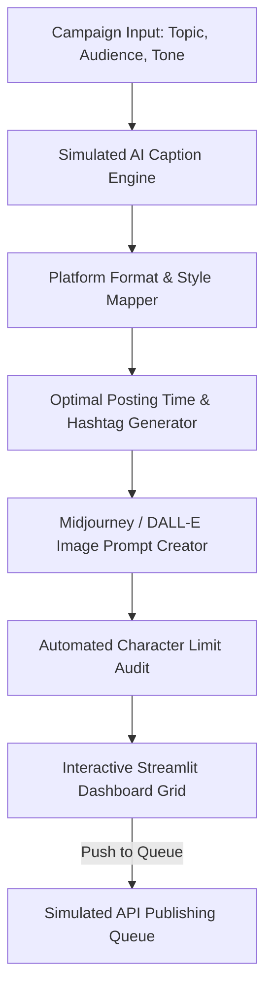

# Week 3 Case Study: AI Social Media Scheduler & Caption Generator

**Developer:** Ali Ammar Haider  
**Program:** SafeX Solutions Summer Internship — Group 54  
**Project:** AI & ML Department – AI Agent Automation Proposal Suite  
**Target Business:** Online Tutoring Platform (LearnHub Academy)  
**Submission Status:** Submission Ready  

---

## 1. Executive Summary

As a member of Group 54, my task for Week 3 was to design and implement an **AI-Powered Social Media Scheduler & Caption Generator** tailored for an online tutoring platform (*LearnHub Academy*). 

The prototype acts as an autonomous content planning agent that generates a cohesive 7-day social media campaign. It translates key academic and coding topics into platform-optimized text formats, generates automated Midjourney/DALL-E image prompts, audits character counts (specifically for X/Twitter limits), and provides an interactive integration proposal outlining connection flows to live social media APIs.

---

## 2. Business Objectives & Target Company Mapping

- **Target Business:** Online Tutoring Platform (LearnHub Academy)
- **Top Marketing Pain Points Addressed:**
  1. High resource costs of manually drafting platform-specific content daily.
  2. Inconsistent posting schedules leading to poor audience engagement.
  3. Platform layout violations (e.g. text truncation or tweet limit errors).
- **Key Performance Deliverables:**
  - Dynamic caption generation utilizing specific tone rules (Professional, Friendly, Motivational, Promotional).
  - Target platform constraints checks (character limit audit and warning system).
  - Suggested creative asset visual prompts to accompany the text updates.
  - Ready-to-use API payloads for automated posting queues.

---

## 3. Platform Configuration & Formatting Constraints

The scheduler classifies and audits posts against target social platform constraints:

| Social Platform | Character Limit | Formatting Style | Suggested Optimal Posting Time |
|---|---|---|---|
| **LinkedIn** | 3,000 | Structured, professional paragraphs, value bullets, CTAs, and 3-4 professional hashtags. | 09:00 AM (Workday Start Peak) |
| **Instagram** | 2,200 | Visually rich, emoji headers, friendly tone, spacing, and up to 6 niche-focused hashtags. | 06:00 PM (Leisure Scroll Peak) |
| **X (Twitter)** | 280 | Short, highly punchy hook, concise details, and 2 target hashtags (keeps under 280-char limit). | 01:00 PM (Lunch Break Peak) |
| **Facebook** | 5,000 | Community-centric, engaging questions to prompt discussion in comments, friendly tone. | 02:00 PM (Mid-day Dip Peak) |

---

## 4. System Architecture & Technical Workflow



- **Caption Generator Engine:** Maps key educational topics (e.g., Python Basics, AI Tools, Career Tips, Excel) to custom-designed prompt hooks and outline structures matching the requested tone.
- **Auditing Logic:** Evaluates combined caption and hashtag strings, calculating string length and setting a boolean `Meets Limit` flag. If a post exceeds limits, the Streamlit UI triggers a red alert message suggesting manual truncation.
- **API Integration Proposal:** Contains fully functional Python SDK templates showcasing meta Graph API (Instagram), Tweepy (X), and LinkedIn UGC sharing calls, ready to be converted into API endpoints.

---

## 5. Automated Verification & Testing

To ensure code stability and correct formatting behavior, a dedicated unit test suite was written in `week3/tests/test_social_media_scheduler.py`:

- **`test_calendar_generation_basic`**: Assures the 7-day schedule returns a populated Pandas DataFrame containing all required meta-columns.
- **`test_platform_specific_twitter_limit`**: Assures that Twitter (X) posts are filtered correctly to remain within the strict 280-character boundary.
- **`test_tone_variation`**: Assures that shifting tone inputs dynamically alters the generated text hook.
- **`test_image_prompt_generation`**: Assures visual image prompt outputs contain core topic terms and aspect ratio flags (`--ar 16:9`).
- **`test_engine_info`**: Assures engine developer identity and registry sync states remain correct.

---

## 6. How to Run & Review

1. Navigate to the `week3/` directory.
2. Run automated validation checks:
   ```bash
   python -m pytest tests/
   ```
3. Start the Streamlit application:
   ```bash
   streamlit run src/app.py
   ```
4. Access the sidebar menu and select **📅 AI Social Media Scheduler & Caption Generator**. Configure campaign parameters and review output metrics, interactive day cards, and the API proposal dashboard.
